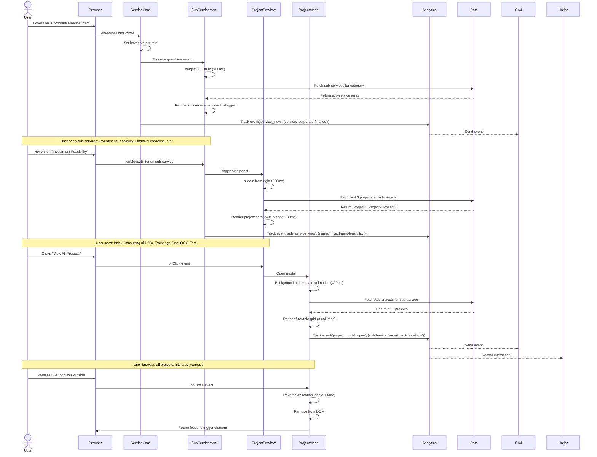
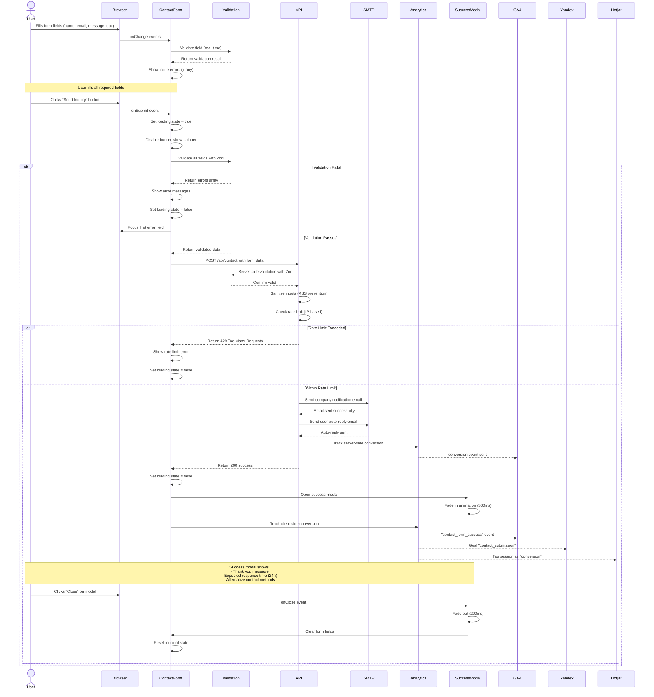
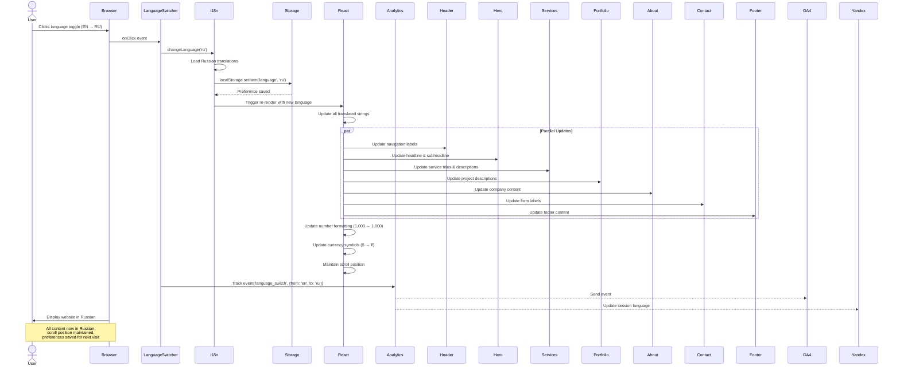
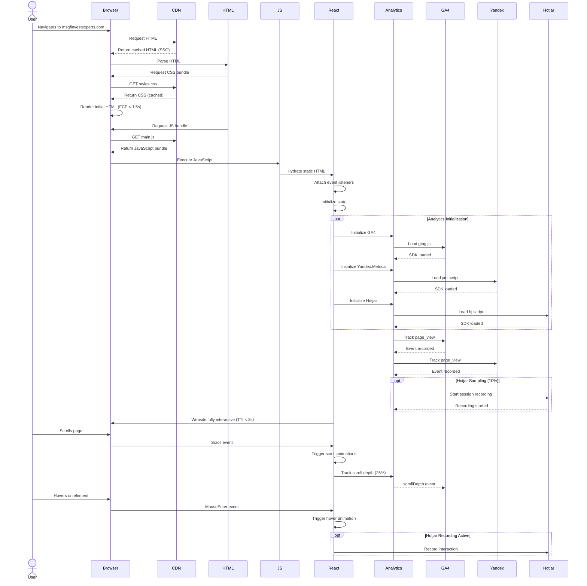
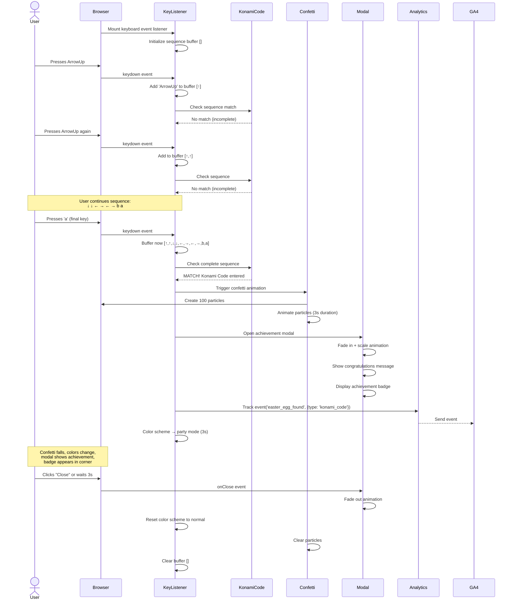

# Sequence Diagrams - Key User Interactions
## MsgFinvestExperts Website

### Overview
This document contains sequence diagrams for the most critical user interactions on the MsgFinvestExperts website.

---

## 1. Service Exploration Flow (3-Level Navigation)

### Description
User explores services through the interactive 3-level menu system: Service Card → Sub-Service → Project Details

### Sequence Diagram



### Technical Details

**Performance Considerations:**
- Sub-service data pre-loaded at build time (no API call)
- Project data bundled in JavaScript (static import)
- Animations use GPU-accelerated transforms
- Modal uses React Portal for proper layering
- Intersection Observer for scroll-based reveals

**Accessibility:**
- Keyboard navigation: Tab through cards, Enter to open
- ARIA labels on all interactive elements
- Focus management on modal open/close
- Screen reader announcements for state changes
- ESC key closes modal

**State Management:**
```typescript
// Service Card State
const [isHovered, setIsHovered] = useState(false);
const [expandedSubService, setExpandedSubService] = useState<string | null>(null);

// Project Modal State
const [isModalOpen, setIsModalOpen] = useState(false);
const [selectedSubService, setSelectedSubService] = useState<SubService | null>(null);
const [filterYear, setFilterYear] = useState<number | null>(null);
const [filterSize, setFilterSize] = useState<string | null>(null);
```

---

## 2. Contact Form Submission Flow

### Description
User fills and submits contact form, triggering validation, email delivery, and analytics tracking.

### Sequence Diagram



### Email Templates

**Company Notification Email:**
```
Subject: New Website Inquiry - [Service Interest]

From: [User Name] <[User Email]>
Company: [Company Name]
Phone: [Phone Number]
Service Interest: [Selected Services]
Project Budget: [Selected Range]

Message:
[User Message]

---
Submitted: [Timestamp]
Language: [EN/RU]
User IP: [IP Address]
Referrer: [Referrer URL]
```

**User Auto-Reply Email:**
```
Subject: Thank You for Contacting MsgFinvestExperts

Dear [User Name],

Thank you for your inquiry regarding our [Service Interest] services.

We have received your message and will respond within 24 hours. A member of our team will contact you at [User Email] or [Phone Number] to discuss your project needs.

In the meantime, you may find these resources helpful:
- Our Capabilities Brochure: [Download Link]
- Case Studies: [Website Link]
- Schedule a Call: [Calendly Link]

Best regards,
MsgFinvestExperts Team

---
This is an automated message. Please do not reply to this email.
```

### API Implementation Details

```typescript
// /app/api/contact/route.ts
export async function POST(request: Request) {
  try {
    // 1. Parse request body
    const body = await request.json();
    
    // 2. Validate with Zod schema
    const validated = contactFormSchema.parse(body);
    
    // 3. Check rate limit
    const ip = request.headers.get('x-forwarded-for') || 'unknown';
    const rateLimitKey = `contact_${ip}`;
    if (await isRateLimited(rateLimitKey, 10, 3600)) {
      return NextResponse.json(
        { error: 'Too many requests. Please try again later.' },
        { status: 429 }
      );
    }
    
    // 4. Sanitize inputs
    const sanitized = {
      ...validated,
      name: sanitizeHtml(validated.name),
      message: sanitizeHtml(validated.message)
    };
    
    // 5. Send emails
    await Promise.all([
      sendCompanyNotification(sanitized),
      sendAutoReply(sanitized)
    ]);
    
    // 6. Track conversion (server-side)
    await trackConversion('contact_form_submit', sanitized);
    
    // 7. Return success
    return NextResponse.json({ success: true });
    
  } catch (error) {
    console.error('Contact form error:', error);
    return NextResponse.json(
      { error: 'Failed to process form submission' },
      { status: 500 }
    );
  }
}
```

---

## 3. Language Switch Flow

### Description
User switches website language, triggering content translation and preference persistence.

### Sequence Diagram



### i18n Implementation

```typescript
// lib/i18n.ts
import i18n from 'i18next';
import { initReactI18next } from 'react-i18next';
import translationEN from '@/locales/en/translation.json';
import translationRU from '@/locales/ru/translation.json';

i18n
  .use(initReactI18next)
  .init({
    resources: {
      en: { translation: translationEN },
      ru: { translation: translationRU }
    },
    lng: typeof window !== 'undefined' 
      ? localStorage.getItem('language') || 'en'
      : 'en',
    fallbackLng: 'en',
    interpolation: {
      escapeValue: false
    }
  });

export default i18n;
```

**Translation File Structure:**
```json
// locales/en/translation.json
{
  "header": {
    "nav": {
      "home": "Home",
      "services": "Services",
      "projects": "Projects",
      "about": "About",
      "contact": "Contact"
    }
  },
  "hero": {
    "headline": "Transforming Vision into Funded Reality",
    "subheadline": "Premier consulting firm managing $5B+ in secured investments"
  },
  "services": {
    "title": "Comprehensive Consulting Solutions",
    "categories": {
      "corporateFinance": {
        "title": "Corporate Finance Consulting",
        "description": "Comprehensive investment project development..."
      }
    }
  }
}
```

---

## 4. Page Load & Analytics Initialization

### Description
Complete sequence from initial page request to fully interactive website with analytics tracking.

### Sequence Diagram



### Performance Timeline

```
0ms:    User requests page
50ms:   HTML received from CDN
100ms:  CSS parsed, initial render
200ms:  FCP (First Contentful Paint)
500ms:  JavaScript bundle loads
700ms:  React hydration begins
1000ms: React hydration complete
1200ms: Analytics SDKs initialize
1500ms: LCP (Largest Contentful Paint)
2000ms: All animations ready
2500ms: TTI (Time to Interactive)
3000ms: Page fully loaded
```

### Critical Rendering Path Optimization

**Strategies Implemented:**
1. **Inline Critical CSS:** Above-the-fold styles inlined in HTML
2. **Async JavaScript:** Non-critical scripts loaded asynchronously
3. **Preload Fonts:** WOFF2 fonts preloaded with `<link rel="preload">`
4. **Image Optimization:** WebP/AVIF with lazy loading
5. **Code Splitting:** Route-based chunking for optimal bundle size
6. **Resource Hints:** DNS prefetch for external domains (analytics)

---

## 5. Easter Egg Discovery Flow (Konami Code Example)

### Description
User discovers hidden easter egg by entering the Konami Code sequence.

### Sequence Diagram



### Implementation

```typescript
// components/easterEggs/KonamiCode.tsx
const KONAMI_SEQUENCE = [
  'ArrowUp', 'ArrowUp', 'ArrowDown', 'ArrowDown',
  'ArrowLeft', 'ArrowRight', 'ArrowLeft', 'ArrowRight',
  'b', 'a'
];

export function KonamiCode() {
  const [buffer, setBuffer] = useState<string[]>([]);
  const [activated, setActivated] = useState(false);

  useEffect(() => {
    const handleKeyDown = (e: KeyboardEvent) => {
      const newBuffer = [...buffer, e.key].slice(-10);
      setBuffer(newBuffer);

      if (newBuffer.join(',') === KONAMI_SEQUENCE.join(',')) {
        setActivated(true);
        trackEvent('easter_egg_found', { type: 'konami_code' });
        
        // Trigger effects
        triggerConfetti();
        setPartyMode(true);
        showAchievementModal();
        
        // Reset after 3 seconds
        setTimeout(() => {
          setActivated(false);
          setPartyMode(false);
          setBuffer([]);
        }, 3000);
      }
    };

    window.addEventListener('keydown', handleKeyDown);
    return () => window.removeEventListener('keydown', handleKeyDown);
  }, [buffer]);

  return activated ? <ConfettiAnimation /> : null;
}
```

---

## Summary

These sequence diagrams illustrate the critical user interaction flows for the MsgFinvestExperts website:

1. **Service Exploration** - Complex 3-level navigation system
2. **Contact Form** - Form validation, submission, and email delivery
3. **Language Switch** - i18n implementation with persistence
4. **Page Load** - Performance-optimized initialization
5. **Easter Egg** - Example of hidden interaction discovery

Each flow is designed for:
- **Performance:** Optimized animations, lazy loading, caching
- **Accessibility:** Keyboard navigation, ARIA labels, focus management
- **Analytics:** Comprehensive event tracking for business insights
- **User Experience:** Smooth transitions, clear feedback, error handling

These diagrams serve as the technical blueprint for implementing the website's interactive features.